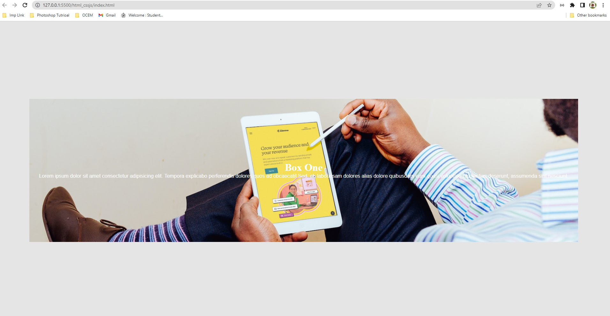
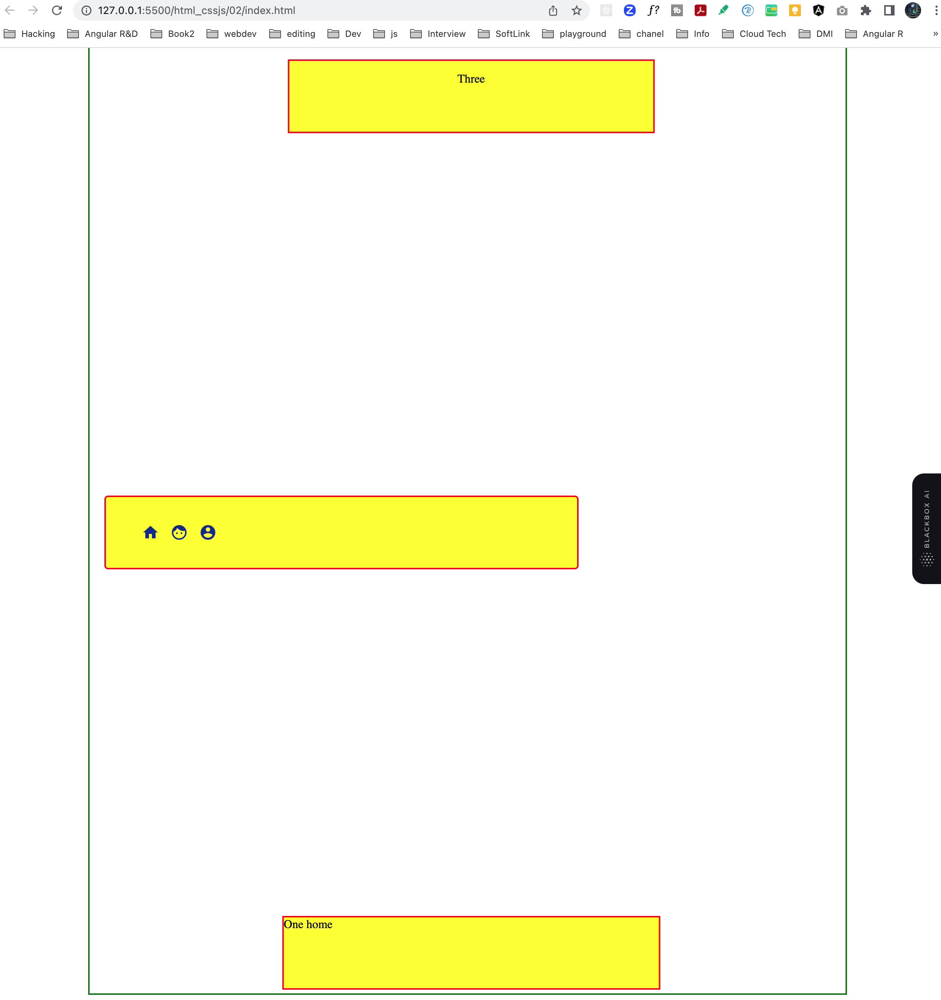
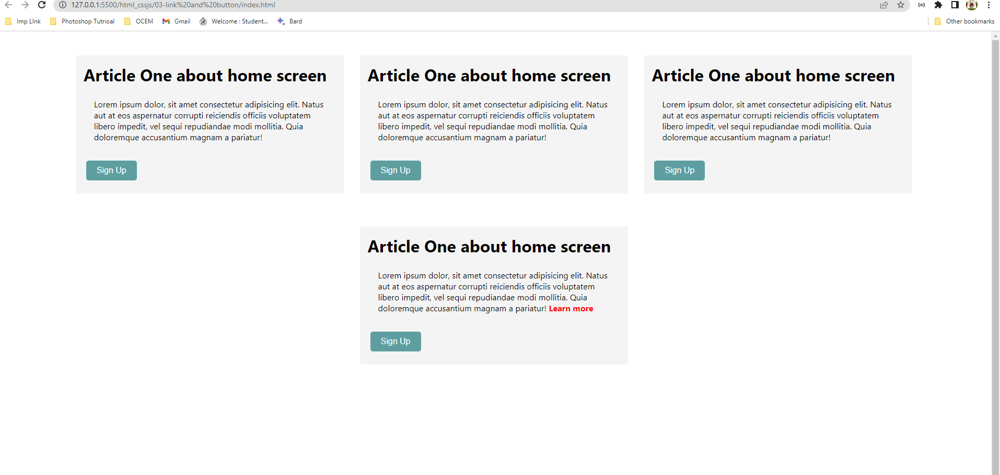
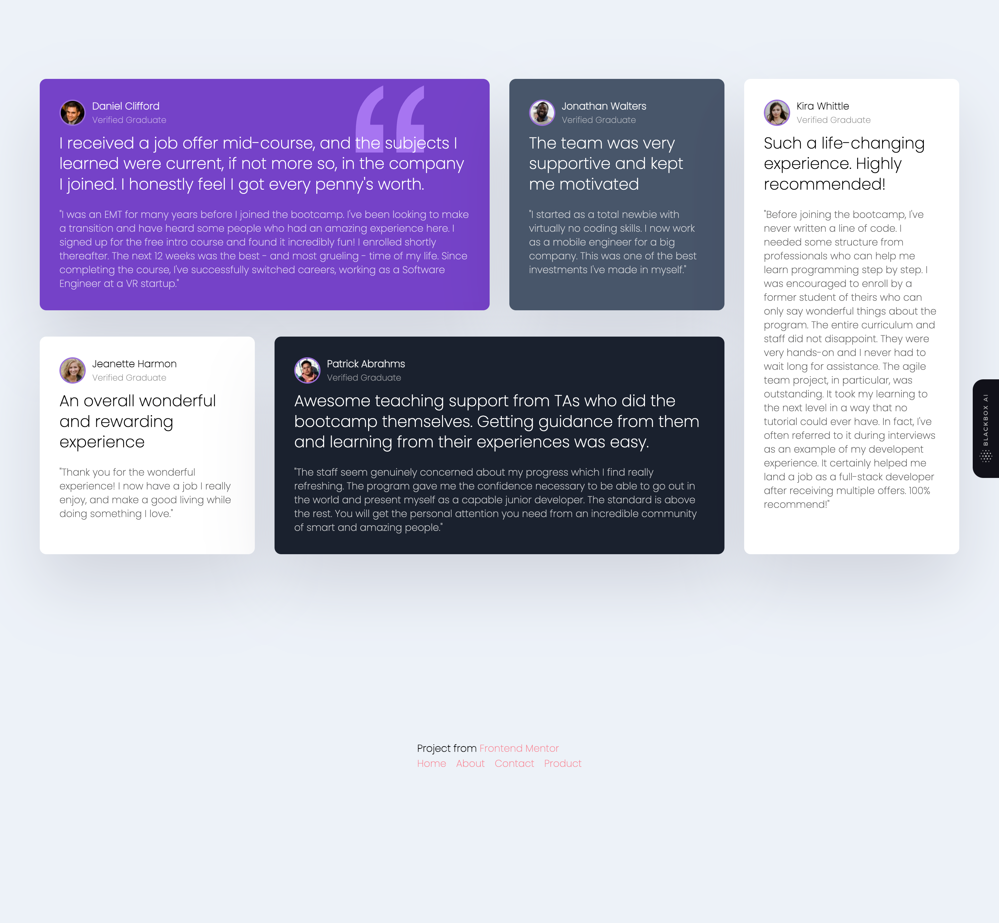
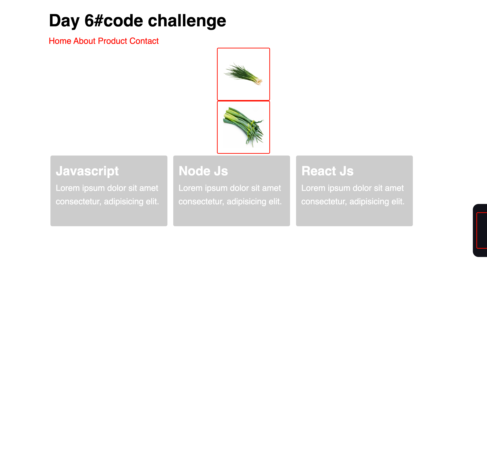
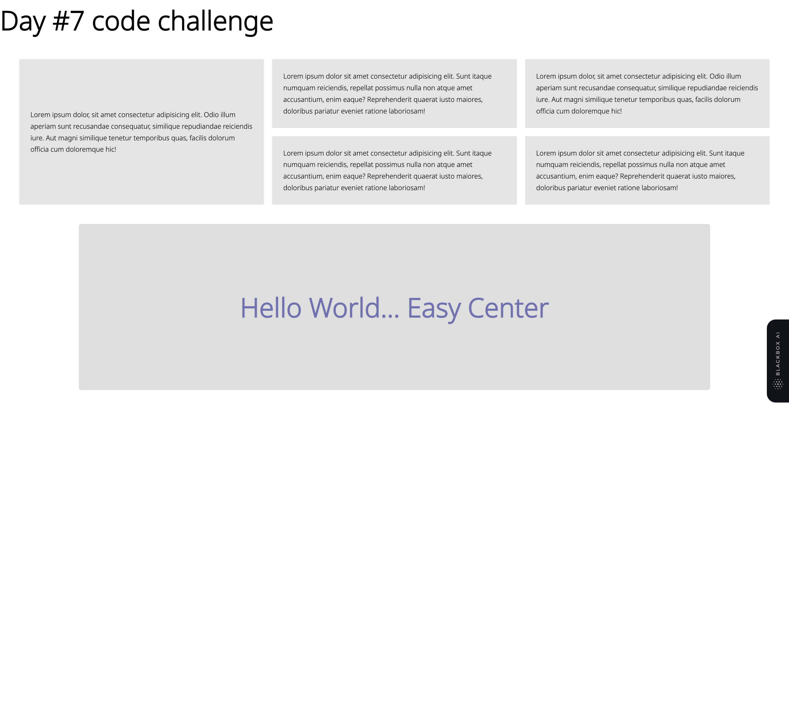
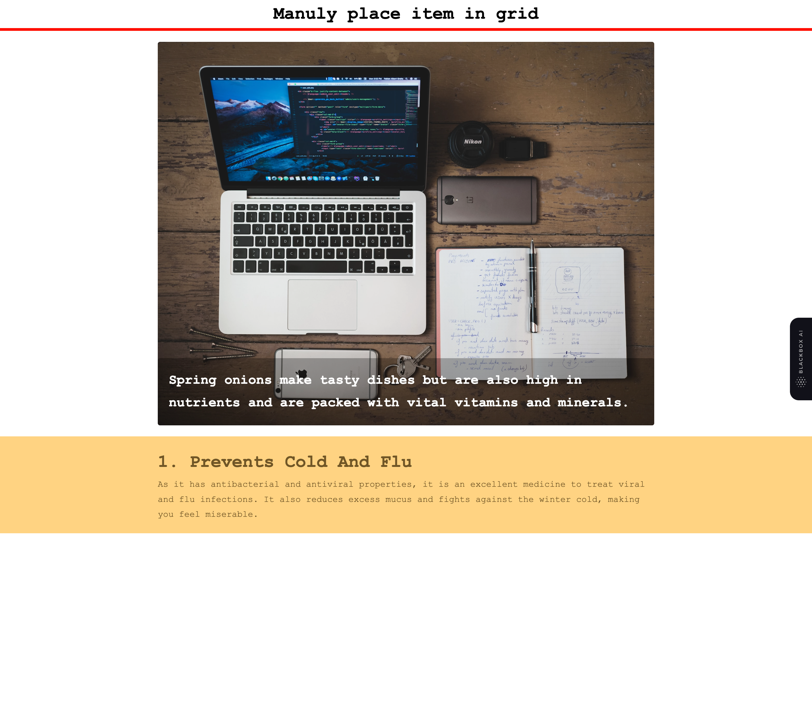
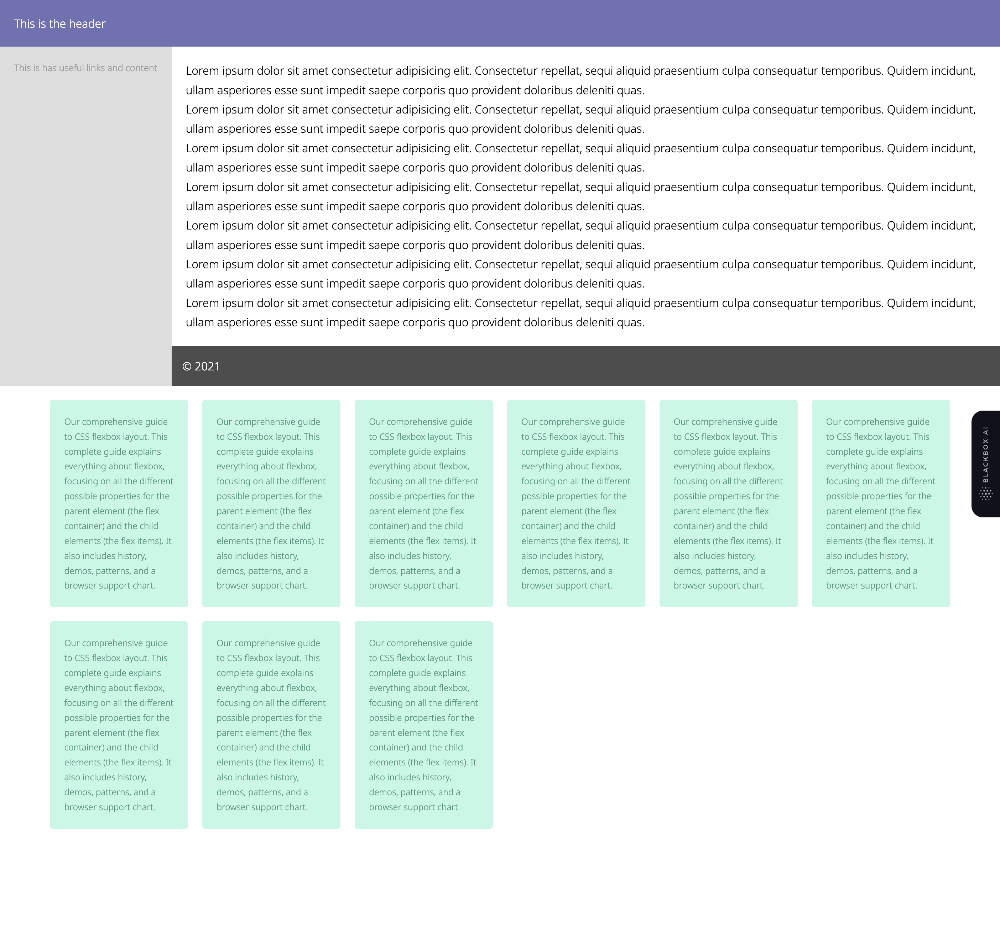
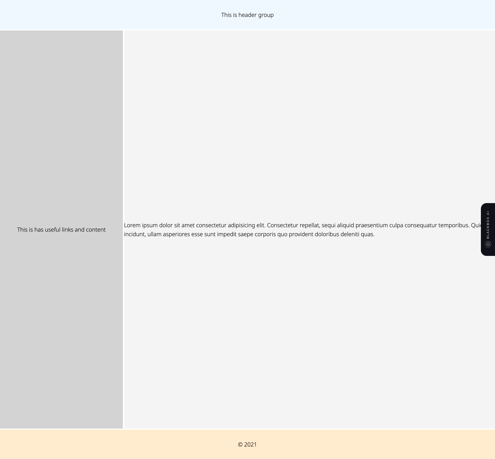

## demo code to be publish

### Useful online resource for codeing
https://www.udemy.com/ (premium)
https://www.freecodecamp.org/ ( free resource )
https://codewithmosh.com/ ( premium docker )
https://codedamn.com/
https://medium.com/
https://academind.com/ (premium aws, react)
https://learn.codevolution.dev/ ( premium javascript question )
https://codedamn.com/ (premium for front-end dev)

## day -1 css background

## day -2 css position (static,relative,absolute,fixed)

## day -3 link and button

## day -4 grid,flex,flex-basis and image

here fix an image inside a div

## day -5 grid brush up and created testimonials

## day -6 inline vs block and  display-inline

## day -7 grid easy center, center align child element and content

## day -8 manualy place the items using grid and avoid extra inner div to cebter element

## day -9 layout and brush up on grid

## day -10 layout and grid and place items to center

## day -11 center element using grid and flex